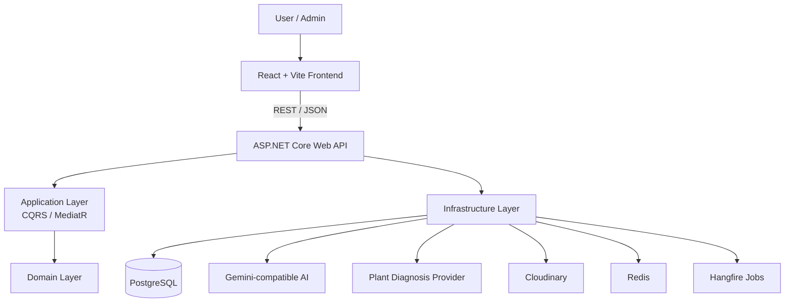
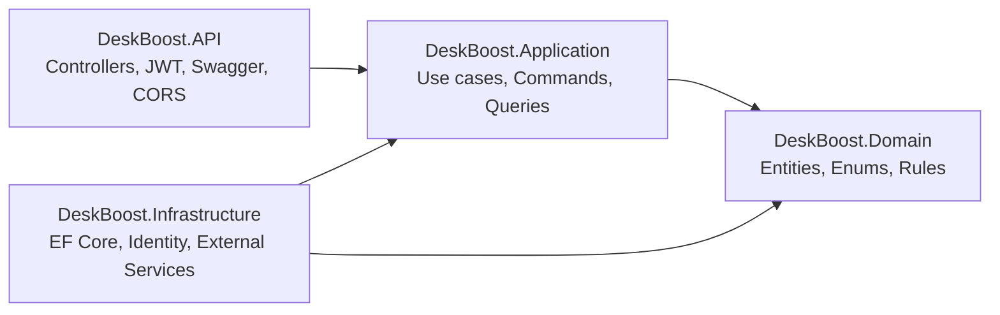

<div align="center">

# DeskBoost 🌱

### AI-Powered Plant Care & Contact-First Marketplace Platform

AI diagnosis, care reminders, personal plant profiles, and a contact-first plant marketplace for desk plant owners.


</div>

> [!NOTE]
> DeskBoost is **contact-first**, not checkout-first. Users browse plants/products, review care context, then contact sellers through social channels. Cart, payment, shipping, and order workflows are intentionally outside the MVP.

## Overview

DeskBoost validates a focused startup thesis: people are more likely to buy and keep desk plants alive when product discovery, care support, and AI guidance live in one simple experience.

| Goal                   | MVP Value                                                     |
| ---------------------- | ------------------------------------------------------------- |
| Plant care confidence  | Plant profiles, care notes, reminders, completion tracking    |
| AI support             | Image diagnosis and plant-care chat through backend providers |
| Marketplace validation | Public browsing plus direct seller contact                    |
| Portfolio value        | Full-stack architecture, startup scope, mobile path           |

Built for EXE201 evaluation, lecturers, recruiters, and public GitHub visitors.

## Features

| 🌿 Plant Care       | 🛍️ Marketplace      | 🤖 AI                    | 🛠️ Admin              |
| ------------------- | ------------------- | ------------------------ | --------------------- |
| My Plants           | Product listing     | Image diagnosis          | Dashboard             |
| Plant profiles      | Product detail      | Plant-care assistant     | User management       |
| Care reminders      | Contact seller flow | Context-aware answers    | Plant inventory       |
| Completion tracking | Verified feedback   | Dialog/history tracking  | Marketplace CRUD      |
| Notifications       | No cart/checkout    | Quota monitoring support | Feedback verification |

| Included                          | Excluded For MVP               |
| --------------------------------- | ------------------------------ |
| Contact-first marketplace         | Cart, checkout, payment        |
| Manual/social purchase validation | Orders, shipping, refunds      |
| Plant diagnosis and AI care chat  | General-purpose chatbot        |
| Lightweight admin                 | Enterprise admin suite         |
| Capacitor Android path            | Google Play production release |

## Tech Stack

| Layer           | Technology                                                         |
| --------------- | ------------------------------------------------------------------ |
| Frontend        | React 19, Vite 6, TypeScript, JavaScript, React Router DOM 7       |
| UI / Motion     | Tailwind-based UI, shared components, GSAP, `@gsap/react`          |
| Mobile          | Capacitor Android, `FE/android`, `vn.deskboost.app`                |
| Backend         | ASP.NET Core Web API, .NET 8, Clean Architecture                   |
| Application     | CQRS, MediatR, FluentValidation, AutoMapper                        |
| Database        | PostgreSQL, Entity Framework Core, migrations                      |
| Auth / Security | JWT Bearer, Google Auth support, BCrypt                            |
| Infra           | Cloudinary, Firebase Admin, Hangfire, Redis, Serilog, Swagger      |
| AI              | Gemini-compatible assistant provider, plant diagnosis API provider |
| Hosting         | Vercel/GitHub Pages/static frontend, Docker/.NET backend hosting   |

## Architecture

Frontend secrets stay out of the browser. The React app calls the ASP.NET Core API; the API owns auth, persistence, AI calls, image storage, and background infrastructure.





## Project Structure

```text
deskboost/
├── BE/DeskBoost/
│   ├── DeskBoost.API/              # ASP.NET Core API
│   ├── DeskBoost.Application/      # CQRS use cases
│   ├── DeskBoost.Domain/           # Entities and rules
│   ├── DeskBoost.Infrastructure/   # EF Core, providers, jobs
│   ├── DeskBoost.sln
│   └── Dockerfile
├── FE/
│   ├── android/                    # Capacitor Android project
│   ├── components/                 # Shared UI
│   ├── context/                    # Auth/care contexts
│   ├── i18n/                       # vi/en UI localization
│   ├── pages/                      # Public, user, AI, admin pages
│   ├── routes/                     # Router and guards
│   ├── services/                   # API service layer
│   ├── capacitor.config.ts
│   └── package.json
├── docs/                           # Product/API/architecture docs
├── plans/                          # Planning notes
└── DEPLOY_CHI_TIET.md              # Detailed deployment guide
```

## Setup

Prerequisites: Node.js, npm, Git, .NET 8 SDK, PostgreSQL. Optional: Docker, Android Studio, Capacitor CLI, EF CLI.

### Frontend

```bash
cd FE
npm install
npm run dev
```

Local URL: `http://localhost:5173`

```bash
npm run lint
npm run build
npm run preview
```

### Backend

```bash
cd BE/DeskBoost
dotnet restore
dotnet build
dotnet run --project DeskBoost.API/DeskBoost.API.csproj
```

```bash
dotnet ef database update --project DeskBoost.Infrastructure --startup-project DeskBoost.API
```

## Environment Variables

> [!IMPORTANT]
> Never commit real API keys, database passwords, JWT secrets, provider credentials, cookies, private keys, or production `.env` files.

| Area     | Example Key                                                            | Purpose                      |
| -------- | ---------------------------------------------------------------------- | ---------------------------- |
| Frontend | `VITE_API_URL`                                                         | Backend API base URL         |
| Frontend | `VITE_GOOGLE_CLIENT_ID`                                                | Google OAuth client ID       |
| Mobile   | `VITE_MOBILE_APP`                                                      | Mobile build flag            |
| Backend  | `ConnectionStrings__DefaultConnection`                                 | PostgreSQL connection        |
| Backend  | `Jwt__Key`                                                             | JWT signing secret           |
| Backend  | `Gemini__ApiKey`                                                       | AI assistant provider key    |
| Backend  | `PlantId__ApiKey`                                                      | Plant diagnosis provider key |
| Backend  | `Cloudinary__CloudName`, `Cloudinary__ApiKey`, `Cloudinary__ApiSecret` | Image storage                |

```env
VITE_API_URL=http://localhost:5000/api
VITE_GOOGLE_CLIENT_ID=your-google-client-id
```

Use .NET user secrets or hosting-provider environment variables for backend secrets.

## Deployment

### Frontend

| Platform                 | Notes                                                |
| ------------------------ | ---------------------------------------------------- |
| Vercel                   | `FE/vercel.json` includes SPA rewrite support        |
| GitHub Pages             | `npm run deploy` publishes `dist` through `gh-pages` |
| Netlify / Static Hosting | Compatible with Vite output                          |

```bash
cd FE
npm install
npm run build
```

Output: `FE/dist`

### Backend

| Platform          | Notes                           |
| ----------------- | ------------------------------- |
| Render            | Docker/.NET friendly            |
| Azure App Service | Native .NET hosting             |
| Railway / Fly.io  | Container-friendly alternatives |
| Docker VPS        | Manual deployment path          |

Backend Dockerfile: `BE/DeskBoost/Dockerfile`

```text
1. Provision PostgreSQL
2. Configure backend env vars
3. Run EF Core migrations
4. Deploy ASP.NET Core API
5. Set frontend VITE_API_URL
6. Build and deploy FE/dist
7. Smoke test auth, marketplace, plant care, AI, admin
```

## Screenshots


## Mobile Roadmap

| Area             | Status                   |
| ---------------- | ------------------------ |
| Capacitor config | `FE/capacitor.config.ts` |
| Android project  | `FE/android/`            |
| App ID           | `vn.deskboost.app`       |
| APK demo         | Gradle debug build path  |
| Google Play      | Future milestone         |

```bash
cd FE
npm run build:mobile
npm run cap:sync
npm run android:build:debug
npm run android:open
```

| Mobile MVP                                                        | Future Native Improvements                                                                                     |
| ----------------------------------------------------------------- | -------------------------------------------------------------------------------------------------------------- |
| My Plants, AI diagnosis, AI chat, reminders, marketplace browsing | Native camera/gallery, secure token storage, push notifications, offline/PWA improvements, Google Play release |

<details>
<summary>Out of current MVP scope</summary>

Cart, checkout, payment, orders, shipping, refunds, enterprise admin dashboard, raw API key editing in frontend/admin UI, and chatbot behavior outside plant care.

</details>

## Team

| Name           | Role                         | Focus                                               |
| -------------- | ---------------------------- | --------------------------------------------------- |
| DeskBoost Team | Product & Startup Validation | MVP scope, EXE201 evaluation, feedback loop         |
| DeskBoost Team | Frontend                     | React/Vite SPA, UI, i18n, mobile-ready UX           |
| DeskBoost Team | Backend                      | ASP.NET Core API, PostgreSQL, auth, admin workflows |
| DeskBoost Team | AI & Mobile                  | Diagnosis, AI assistant, Capacitor Android path     |

| Program                | Institution    |
| ---------------------- | -------------- |
| EXE201 Startup Project | FPT University |

## License

No license file is currently detected. Before public release, add a `LICENSE` file and confirm the selected license with the team.

---

<div align="center">

**DeskBoost** — healthier desk plants, clearer care routines, and trust-first plant discovery.

</div>
