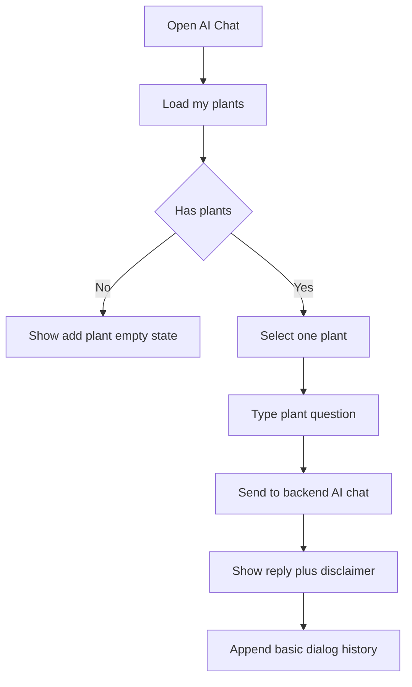

# DeskBoost – Frontend Adjustment Plan

> Planning only. Do not implement FE changes until approved.

---

## 1. Current Gap Analysis

| Area           | Current state                                           | Gap                                                              |
| -------------- | ------------------------------------------------------- | ---------------------------------------------------------------- |
| AI Chat        | `aiApi.js` has `chatWithAI`; `ChatbotWidget.jsx` exists | Need approved MVP AI Chat page/route/plant selector/history UI   |
| Admin          | Old admin removed from active routes/nav                | Need lightweight admin MVP, not old enterprise dashboard         |
| Auth roles     | Auth shell exists                                       | Need simple `USER` / `ADMIN` support + admin guard               |
| Backend target | Some old planning referenced NestJS/Prisma              | Align all active planning with ASP.NET Core Web API + PostgreSQL |
| Marketplace    | Public list/detail exists                               | Keep contact-only; avoid cart/order/payment                      |
| API services   | User services exist                                     | Need `adminApi.js`; extend `aiApi.js` for dialog history         |
| Navigation     | User sidebar lacks AI Chat; no admin nav                | Add minimal AI Chat nav + admin entry for ADMIN only             |

---

## 2. What FE Currently Has

Routes in `FE/routes/AppRouter.tsx`:

```txt
/
/plants
/plants/:plantId
/login
/register
/forgot-password
/app/dashboard
/app/my-plants
/app/my-plants/:id/profile
/app/add-plant
/app/profile
/app/ai-analysis
/app/settings
```

Navigation:

- `Navbar.jsx`: home, plants, login/profile/logout, care bell.
- `UserSidebar.jsx`: dashboard, my plants, AI analysis, profile, reminders/settings.

Services:

- `api.js`
- `authApi.js`
- `userApi.js`
- `plantApi.js`
- `reminderApi.js`
- `aiApi.js`
- `feedbackApi.js`

Auth/admin/AI files present:

- `AuthContext.jsx`
- `useAuth.js`
- `ProtectedRoute.jsx`
- `authStorage.js`
- `AIPlantAnalysis.jsx`
- `ChatbotWidget.jsx`
- `aiApi.js`

---

## 3. What Needs To Be Changed

- Add AI Chat as approved user MVP page.
- Add lightweight Admin Dashboard routes/pages.
- Add simple role-aware route guard.
- Add admin service module.
- Extend AI service for dialog history endpoints.
- Update navigation without ecommerce/admin bloat.
- Keep all API keys backend-only.

---

## 4. New/Updated Routes Needed

User:

```txt
/app/ai-chat -> AIChat
```

Admin:

```txt
/admin                    -> AdminDashboard
/admin/users              -> AdminUsers
/admin/user-plants        -> AdminUserPlants
/admin/plant-status       -> AdminPlantStatus
/admin/marketplace-plants -> AdminMarketplacePlants
/admin/ai-dialogs         -> AdminAiDialogs
/admin/ai-config          -> AdminAiConfigStatus
```

Guarding:

- `/app/*`: authenticated users.
- `/admin/*`: authenticated + `role === "ADMIN"`.

Fallback:

- Unauthorized admin access -> redirect to `/app/dashboard` or show simple forbidden page.

---

## 5. New/Updated Pages Needed

New user page:

- `AIChat.jsx`: select existing plant, send plant-specific message, show reply/history.

New admin pages:

- `AdminDashboard.jsx`
- `AdminUsers.jsx`
- `AdminUserPlants.jsx`
- `AdminPlantStatus.jsx`
- `AdminMarketplacePlants.jsx`
- `AdminAiDialogs.jsx`
- `AdminAiConfigStatus.jsx`

Update existing pages only if required:

- `Login.jsx` / `Register.jsx`: preserve returned user `role`.
- `Dashboard.jsx`: optional link/card to AI Chat.
- `AIPlantAnalysis.jsx`: optional link to continue in AI Chat with selected plant.

---

## 6. New/Updated Services Needed

Update `aiApi.js`:

```js
chatWithAI(payload);
getMyAiDialogs();
getMyAiDialog(id);
```

Add `adminApi.js`:

```js
getAdminSummary();
getAdminUsers(params);
getAdminUser(id);
updateAdminUserStatus(id, payload);
getAdminUserPlants(params);
getAdminUserPlant(id);
updateAdminUserPlantStatus(id, payload);
getAdminMarketplacePlants(params);
createAdminMarketplacePlant(payload);
updateAdminMarketplacePlant(id, payload);
deleteAdminMarketplacePlant(id);
getAdminAiDialogs(params);
getAdminAiDialog(id);
getAdminAiConfigStatus();
```

No payment/cart/order/shipping services.

---

## 7. New/Updated Components Needed

Create only if reuse is clear:

- `AdminLayout.jsx`
- `AdminSidebar.jsx`
- `AdminTable.jsx`
- `AdminRoute.jsx`
- `PlantSelector.jsx`
- `AiChatMessageList.jsx`
- `AiChatInput.jsx`
- `AiConfigStatusCard.jsx`

Reuse existing layout/components where practical.

---

## 8. Admin MVP UI Plan

Admin principles:

- Lightweight table/list screens.
- Simple forms only where needed.
- No charts-heavy dashboard.
- No enterprise permission matrix.
- No API key editor.

Pages:

| Page                   | MVP UI                                                |
| ---------------------- | ----------------------------------------------------- |
| AdminDashboard         | Count/status cards + quick links                      |
| AdminUsers             | Basic table: name, email, role, status, created date  |
| AdminUserPlants        | Table: plant, owner, species, status, updated date    |
| AdminPlantStatus       | Simple status list/edit                               |
| AdminMarketplacePlants | Catalog list + add/edit/delete simple display records |
| AdminAiDialogs         | Dialog table + detail                                 |
| AdminAiConfigStatus    | Provider/configured/last checked only                 |

---

## 9. AI Chat MVP UI Plan

Flow:



Rules:

- Must select one existing plant.
- AI response must be plant-specific.
- Use backend only.
- Keep basic history only.
- Avoid general chatbot UX.

State requirements:

- Loading state for plants and chat send.
- Empty state when no plants.
- Inline error + retry for AI failure.
- Disable send while pending.

---

## 10. Risks and Scope-control Notes

- Admin scope can expand quickly -> keep table/form MVP only.
- AI Chat can become general chatbot -> force plant selection and plant context.
- API keys risk -> never expose/edit raw keys in FE.
- Marketplace scope drift -> no cart/order/payment/shipping routes/services.
- Role scope drift -> keep only `USER` / `ADMIN`.
- Backend unavailable -> preserve mock/fallback UX where practical, but do not fake admin complexity.

---

## 11. Step-by-step Implementation Phases

1. Update auth/user model assumptions to preserve `role` from backend/mock data.
2. Add admin route guard.
3. Add AI Chat route/page with plant selector and `aiApi.chatWithAI`.
4. Add AI Chat sidebar navigation.
5. Extend `aiApi.js` for user dialog history.
6. Add `adminApi.js` service wrapper.
7. Add admin layout + lightweight admin navigation.
8. Add admin dashboard summary page.
9. Add admin users page.
10. Add admin user plants + plant status pages.
11. Add admin marketplace plant management page.
12. Add admin AI dialog history page.
13. Add admin AI config status page.
14. Verify no ecommerce routes/services/UI added.
15. Run build/lint after implementation.

---

## 12. Implementation Acceptance Checklist

- AI Chat route exists and requires selected user plant.
- Admin routes are unavailable to non-admin users.
- Admin UI remains lightweight.
- Admin AI config page shows status only, no raw keys.
- Marketplace remains contact-only.
- No cart/checkout/payment/order/shipping files/routes/services added.
- API calls use existing centralized `api.js`.
- Build/lint pass.

---

## Implementation Boundary

This plan does not authorize frontend refactor, backend code generation, or UI implementation by itself. It is ready for review before switching to implementation mode.
