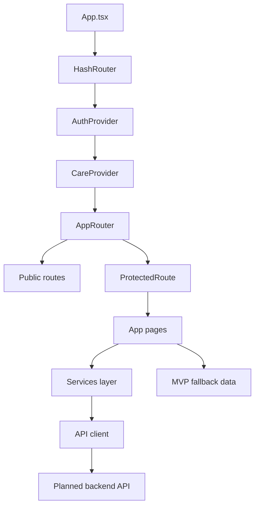

# DeskBoost – Frontend Architecture

> Current frontend source of truth · React 19 + Vite 6 · MVP-only · Backend not implemented yet

---

## Current Status

- Frontend cleanup is completed.
- Active routes are MVP-only.
- Deprecated commerce/admin routes and navigation are not active.
- Central API client exists.
- Service layer exists and follows `docs/api-contract.md`.
- Auth shell exists with protected `/app/*` routes.
- `mockData.ts` is reduced to MVP fallback data only.
- Backend is not implemented yet.

---

## Current Frontend Architecture

```txt
FE/
├── App.tsx
├── index.tsx
├── package.json
├── routes/
│   ├── AppRouter.tsx
│   └── ProtectedRoute.jsx
├── pages/
│   ├── Home.jsx
│   ├── PlantList.jsx
│   ├── PlantDetail.jsx
│   ├── Login.jsx
│   ├── Register.jsx
│   ├── ForgotPassword.jsx
│   ├── Dashboard.jsx
│   ├── MyPlants.jsx
│   ├── PlantProfile.jsx
│   ├── AddPlantUser.jsx
│   ├── UserProfile.jsx
│   ├── AIPlantAnalysis.jsx
│   └── RemindersSettings.jsx
├── components/
│   ├── Navbar.jsx
│   ├── UserLayout.jsx
│   ├── UserSidebar.jsx
│   ├── CareNotificationBell.jsx
│   ├── ChatbotWidget.jsx
│   ├── FloatingHomeButton.jsx
│   └── ThemeToggle.tsx
├── context/
│   ├── AuthContext.jsx
│   └── CareContext.jsx
├── hooks/
│   └── useAuth.js
├── services/
│   ├── api.js
│   ├── authApi.js
│   ├── userApi.js
│   ├── plantApi.js
│   ├── reminderApi.js
│   ├── aiApi.js
│   └── feedbackApi.js
├── utils/
│   └── authStorage.js
└── data/
    └── mockData.ts
```

---

## App Shell

`App.tsx` currently wraps the app with:

```txt
HashRouter
└── AuthProvider
    └── CareProvider
        └── AppRouter
```

Global UI helpers mounted in `App.tsx`:

- `FloatingHomeButton`
- `ThemeToggle`

---

## Routing

`AppRouter.tsx` defines current active routes.

Public routes:

```txt
/                -> Home
/plants          -> PlantList
/plants/:plantId -> PlantDetail
/login           -> Login
/register        -> Register
/forgot-password -> ForgotPassword
```

Protected routes:

```txt
/app/dashboard              -> Dashboard
/app/my-plants              -> MyPlants
/app/my-plants/:id/profile  -> PlantProfile
/app/add-plant              -> AddPlantUser
/app/profile                -> UserProfile
/app/ai-analysis            -> AIPlantAnalysis
/app/settings               -> RemindersSettings
```

Fallback:

```txt
* -> /
```

`ProtectedRoute.jsx` uses `useAuth()` and redirects unauthenticated users to `/login`.

---

## Navigation

`Navbar.jsx` active links/actions:

- `/`
- `/plants`
- `/login` for unauthenticated users
- `/app/profile` for authenticated users
- logout for authenticated users
- `CareNotificationBell` for authenticated users

`UserSidebar.jsx` active links:

- `/app/dashboard`
- `/app/my-plants`
- `/app/ai-analysis`
- `/app/profile`
- `/app/settings`

No active navigation exists for cart, checkout, orders, payment, shipping, or admin.

---

## Auth Architecture

Files:

- `FE/context/AuthContext.jsx`
- `FE/hooks/useAuth.js`
- `FE/routes/ProtectedRoute.jsx`
- `FE/utils/authStorage.js`
- `FE/services/authApi.js`

Current behavior:

- `AuthContext` owns `user`, `token`, `isAuthenticated`, `isLoading`, `error`.
- `useAuth()` exposes auth context to pages/components.
- `authStorage.js` persists `accessToken` and `authUser` in `localStorage`.
- `ProtectedRoute` blocks protected pages when unauthenticated.
- `authApi.js` defaults to mock auth unless `VITE_USE_MOCK_AUTH=false`.
- Real backend auth must return `{ user, accessToken }`.

---

## Services Layer

`FE/services/api.js` is the centralized API client.

Current behavior:

- Base URL: `import.meta.env.VITE_API_URL || "http://localhost:8080/api/v1"`
- Adds `Authorization: Bearer <token>` when token exists.
- Sends JSON by default.
- Supports `FormData` without forcing JSON content type.
- Parses JSON responses.
- Throws `ApiError` with `status`, `code`, `details`.
- Clears local auth on `401`.

Service modules:

| File             | Responsibility                           |
| ---------------- | ---------------------------------------- |
| `authApi.js`     | register, login, forgot password         |
| `userApi.js`     | current user profile                     |
| `plantApi.js`    | public catalog + my-plants CRUD          |
| `reminderApi.js` | reminder CRUD                            |
| `aiApi.js`       | backend-proxied AI diagnose/chat helpers |
| `feedbackApi.js` | feedback submission                      |

---

## Data Strategy

- Runtime data should come from service modules.
- Backend does not exist yet.
- Pages may use local fallback data while backend is missing.
- `FE/data/mockData.ts` contains only MVP fallback catalog and my-plants records.
- Removed mock commerce/admin datasets must not be restored for MVP.

---

## Current MVP Scope

In scope:

- Landing
- Auth
- Add Plant
- My Plants
- AI Diagnosis
- Reminder
- Feedback
- Simple Marketplace

Simple Marketplace means public catalog/detail plus contact-oriented purchase path. It does not include commerce transactions.

---

## Out of Scope

Do not implement or reintroduce:

- Payment
- Cart
- Checkout
- Orders
- Shipping
- Admin dashboard
- QR/NFC
- Workspace scanner
- Advanced analytics
- AI chat

Note: `aiApi.js` includes `chatWithAI()` only because the API contract includes `/ai/chat`. Do not expand AI chat as a frontend MVP product area.

---

## Current Technical Decisions

- Keep frontend lean and MVP-first.
- Do not redesign UI during backend integration.
- Do not add new routes unless they are in MVP scope.
- Do not add backend plans here; use `docs/api-contract.md` as contract source.
- Keep API calls through `FE/services/*` only.
- Keep AI provider keys server-side only.
- Keep marketplace display/contact-only.
- Keep `localStorage` token auth for MVP speed.
- Keep out-of-scope commerce/admin code removed from active app.

---

## Backend Integration Boundary

Backend is planned, not present.

Target stack:

- NestJS
- Prisma
- PostgreSQL
- JWT Bearer auth
- REST JSON API
- `/api/v1` base path

Tuan should implement the finalized API contract only. Frontend should not assume extra endpoints beyond `docs/api-contract.md`.

---

## Mermaid Overview



---

## Next Priorities

1. Keep these docs synchronized with real code.
2. Let Tuan implement backend from `docs/api-contract.md`.
3. Turn off mock auth with `VITE_USE_MOCK_AUTH=false` after backend auth is ready.
4. Connect pages to existing service functions without changing scope.
5. Replace fallback data only after backend endpoints exist.
6. Avoid reintroducing commerce/admin/enterprise features.

---

## Known Limitations

- Backend and database are absent.
- Mock auth is enabled by default.
- API calls may fail until backend exists.
- Fallback data remains necessary for frontend usability.
- Reminder data is still local/frontend-oriented.
- Some pages may still need final API wiring.
- `ChatbotWidget.jsx` remains in components, but AI chat is not an MVP feature to expand.
